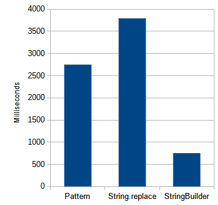

# O Custo de Performance de Usar Regex para Remover Formatação de Strings

Por vezes temos a tarefa de receber dados de entrada mas devemos usá-lo de uma forma diferente no nosso sistema, por exemplo removendo formatações que não fazem sentido nos mundos do nosso código ou banco de dados, tais como:

- A string "R$ 1.450,00" para "1450.00"
- Removendo a máscara de documentos, de "123-456-789-00" para "12345678900"
- Normalizar números de telefone, "+55 (32) 3223-5445" para "553232235445"

A solução parece óbvia se você conhece expressões regulares e como elas podem ser usadas pra fazer tais substituições, e se não conhece, os primeiros resultados de uma pesquisa no Google vão te encaminhar para usá-las a fim de substituir todos os símbolos que você não precisa por uma string vazia, efetivamente removendo o que não te interessa. Uma implementação seria da seguinte forma:


## String.replaceAll()

```java
public String replace(String input) {
    return input.replaceAll("[^0-9]", "");
}
```

O código acima substitui tudo que não está no intervalo dos caracteres de 0 a 9 (todos os números) por nada, removendo-os. Nessa expressão regular o caractere circunflexo define uma negação e o hífen entre 0 e 9 define um intervalo de caracteres a serem correspondidos.

## java.util.regex.Pattern

Se você conhece um pouco mais de Java vai saber que é melhor manter a expressão regular compilada a fim de evitar uma inicialização possivelmente custosa toda vez que você precisar usar a substituição dos caracteres.

```java
private static final Pattern pattern = Pattern.compile("[^0-9]");

public String replacePattern(String input) {
    return pattern.matcher(input).replaceAll("");
}
```

Mas quanto de performance se ganha usando essa abordagem? E podemos executar nossa tarefa ainda mais rápido?

## Método customizado com StringBuilder

Vamos implementar um método que percorre a string de entrada e adiciona cada caractere que nos interessa a um StringBuilder e ignora todo o resto:

```java
public static String replace(String input) {
    StringBuilder sb = new StringBuilder();
    for (int i = 0; i < input.length(); i++) {
        char c = input.charAt(i);
        if (c >= '0' && c <= '9') {
            sb.append(c);
        }
    }
    return sb.toString();
}
```

Muito mais código, mas vamos ver como ele performa em um loop fechado.

## Resultados



Esses são os resultados de 10 execuções cada de 10 milhões de substituições para cada um dos métodos avaliados:

## Conclusão

Se você deseja formatar ou desformatar strings no seu sistema e precisa de toda a performance que você conseguir, use um método customizado para sua necessidade, nesse teste ela foi até cinco vezes mais eficiente do que o método mais óbvio.