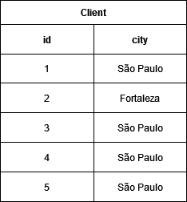
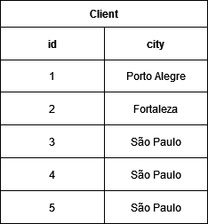
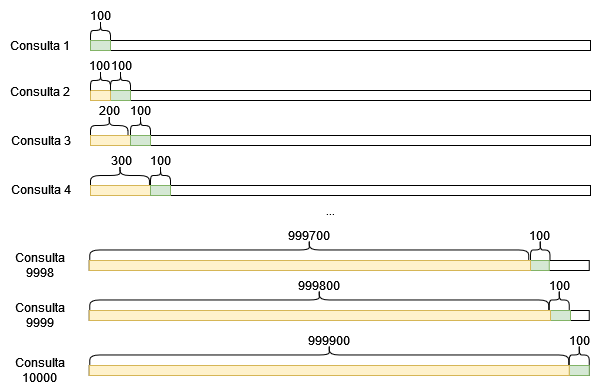
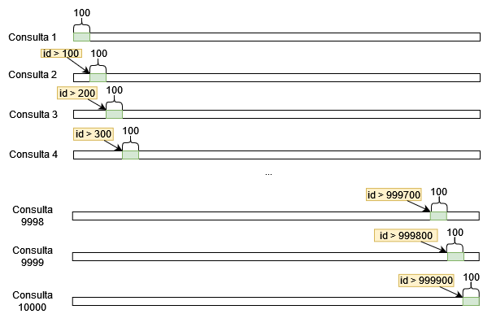

# Como fazer o Select de muitos resultados de forma correta na sua aplicação

Nesse artigo vamos ver alguns erros comuns ao se consultar um número grande de registros de um banco de dados com o propósito de processá-los de alguma forma.

## Trazer o resultado em uma lista

A forma mais simples de fazer o select dos resultados que desejamos seria criar um método que retorne uma lista de objetos. O código abaixo não representa a realidade de nenhum framework de persistência, o objetivo é apenas descrever como a query é executada nos bancos de dados.

```java
public List<Client> findByCity(String city) {
    Query q = buildQuery("select * from client where city = :city");
    q.setParameter("city", city);
    return q.execute();
}
```

Essa abordagem pode funcionar bem quando o volume que temos a retornar é baixo, mas falhará a medida que o número de clientes aumenta. O primeiro fator a se considerar é que a memória necessária para manter e retornar todos os objetos ultrapasse a memória que temos disponível para nossa aplicação, causando assim um OutOfMemoryError. Aumentar a memória nesse caso não é uma solução e estaremos apenas adiando o problema, já que a tendência é que nossa base de dados continue crescendo.

## Fazer a paginação dos resultados

A próxima alternativa consiste em paginar o resultado em lotes menores e de tamanho definido, utilizando para isso o limit (ou correspondente para certos bancos) e offset. Isso evita o estouro de memória mas ainda apresenta alguns problemas em potencial aos quais o desenvolvedor precisa estar atendo. A alteração no método ficaria sendo:

```java
public List<Client> findByCity(String city, int page, int pageSize) {
    Query q = buildQuery("select * from client where city = :city limit :pageSize offset :offset");
    q.setParameter("city", city);
    q.setParameter("pageSize", pageSize);
    q.setParameter("offset", pageSize * page);
    return q.execute();
}
```

Para percorrer todos os resultados faríamos algo como:

```java
int page = 0;
List<Client> clientPage = clientRepository.findByCity(city, page, 100);
while (!clientPage.isEmpty()) {
    // processa os clientes
    page++;
    clientPage = clientRepository.findByCity(city, page, 100);
}
```

Essa abordagem esconde os seguintes problemas:

### 1 – Risco de ordenação embaralhada

Perceba que não definimos nenhum tipo de ordenação para nossa consulta. Isso é um risco pois caso não seja definida uma ordenação, o banco não te garante resultados ordenados. Na prática a primeira consulta irá te retornar 100 clientes em uma ordenação qualquer, nas consultas seguintes o banco pode decidir por uma ordenação diferente, fazendo com que registros já obtidos em outras consultas voltem a aparecer, e registros que não foram obtidos acabem por ser ignorados.

A tratativa para esse cenário é clara, podemos adicionar uma ordenação pela chave primária da entidade na consulta.

```java
Query q = buildQuery("select * from client where city = :city"
    + " order by id limit :pageSize offset :offset")
```

### 2 – Risco de atualizações durante as consultas

Usando uma ordenação contornamos o problema anterior, mas ainda não estamos totalmente protegidos de processar registros duplicados ou de ignorar alguns. Imagine que estamos paginando os resultados que estão contidos na tabela da seguinte forma:



Para simplificar, vamos supor uma paginação de apenas dois resultados e desejamos selecionar os clientes de São Paulo, a primeira consulta irá retornar os registros de id 1 e 3. Agora imagine que durante o processamento identificamos que o cliente 1 sofreu uma alteração e se mudou pra Porto Alegre, e antes da segunda consulta a tabela fica da seguinte forma:



Nesse momento surge o problema: a segunda consulta irá buscar dois clientes de São Paulo saltando dois resultados pela paginação. Os dois primeiros resultados que atendem a condição do cliente ser de São Paulo agora são os registros 3 e 4 e portanto obteremos a próxima página apenas o registro de id=5, ignorando acidentalmente o registro de id=4. Um problema oposto poderia surgir também caso o registro de id=2 atualizasse sua cidade para São Paulo: a segunda página iria consumir o registro de id=3 duas vezes.

### 3 – Ineficiências da paginação

Mesmo se garantirmos que não haverão atualizações da nossa massa de dados durante a paginação, ainda pagamos um custo significativo porém invisível ao usar a paginação dessa forma. Imagine que nossa base é gigantesca, por exemplo 1 milhão de registros de clientes, e vamos percorrer por todos paginando os resultados em lotes de 100. A primeira consulta é a mais básica: percorrerá os 100 primeiros registros por ordem crescente de id e nos devolverá o resultado. A segunda consulta buscará mais 100 registros saltando os 100 primeiros já obtidos anteriormente e para fazer isso o banco de dados precisa percorrer 100 registros para pegar os próximos 100. Para a terceira ele irá percorrer 200 para obter os próximos 100 e assim por diante, até chegar no fim onde ele irá percorrer 999.900 registros para obter os 100 últimos.

O efeito prático é que o processo começa com um tempo bom mas à medida que progride para os últimos resultados a consulta começa a demorar cada vez mais. Essa ineficiência fica demonstrada na imagem abaixo, onde a parte verde são os registros obtidos em cada consulta e a parte amarela são os registros que são percorridos apenas para descobrir o ponto inicial da próxima consulta.



Ou seja, para nossa massa de 1 milhão de registros, **acabamos impondo ao banco de dados percorrer mais de 5 bilhões de registros que nem são retornados no resultado**. Portanto essa forma de paginação embora seja segura no uso de memória é terrivelmente ineficiente.

## Solução

A forma mais eficiente e segura de paginar volumes tão grandes é se basear em um mecanismo básico do banco de dados: a chave primária indexada. A ideia é a seguinte:

- Para a primeira consulta, fazer o select normalmente, ordenando os resultados pelo id (chave primária).
- Para as próximas consultas, obter o id do último registro da última página (last_id) e acrescentar à query anterior a condição client.id > :last_id e repetir esse passo até obtermos um conjunto de resultados vazio.

Em código esse processo fica:

```java
public List<Client> findByCity(String city, int pageSize, int lastId) {
    String queryStr = "select * from client where city = :city";
    if (lastId != 0) {
        queryStr += " and id > :lastId";
    }
    queryStr += " order by id limit :pageSize";
    Query q = buildQuery(queryStr);
    q.setParameter("city", city);
    q.setParameter("pageSize", pageSize);
    if (lastId != 0) {
        q.setParameter("lastId", lastId);
    }
    return q.execute();
}

int lastId = 0;
List<Client> clientPage = clientRepository.findByCity(city, 100, lastId);
while (!clientPage.isEmpty()) {
    // processa os clientes
    lastId = clientPage.get(clientPage.size() - 1).getId();
    clientPage = clientRepository.findByCity(city, 100, lastId);
}
```

Isso funciona pois ao informar a partir de qual id desejamos obter resultados damos uma pista importante ao planejador de execução do banco de dados. Com essa condição definida ele pode usar o índice da chave primária (que é criada automaticamente ao definirmos uma coluna na nossa tabela como chave) e chegar ao próximo registro desejado de forma muito mais eficiente.



Dessa forma o banco não precisa percorrer registros desnecessariamente, o esforço é reduzido consideravelmente com o uso de um índice e de quebra ficamos protegidos contra os problemas de ordenação embaralhada e atualização entre consultas.

## Conclusão

Obter resultados de consultas que retornam uma quantidade grande de registros deixa de ser uma atividade trivial para os desenvolvedores e requer atenção para evitar alguns problemas que podem aparecer com soluções mais simples. A forma mais confiável é fazer a paginação usando a chave primária como condição nas consultas, garantindo um uso de memória constante, sem risco de resultados duplicados ou ignorados e ainda muito eficiente.