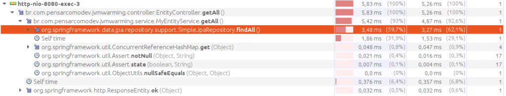

# Esquentar o Java o torna mais rápido

Você sabia que assim como um carro a álcool antigo um programa Java precisa ser esquentado para atingir seu rendimento ideal? Pra saber como isso funciona e também não ser pego de surpresa com cenários bizarros vamos ver no detalhe como ocorre a execução de um programa Java.

## Linguagens compiladas e o Java

Programas escritos em C, C++ e outras linguagens afins executam em um computador pelo processo de compilação do código fonte em um conjunto binário de instruções, específicos a uma arquitetura de processador e sistema operacional, que são carregadas e executadas de forma compatível com a CPU. Esses são conhecidos por programas nativos. Por serem compilados com o sistema destino previamente definido, os programas feitos para Linux não irão rodar em Windows ou mesmo em um Linux rodando em um processador de celular.

Na contramão dessas restrições, o Java foi criado com a proposta de “escreva uma vez, rode em qualquer lugar”, significando que um programa pode ser executado através de uma máquina virtual (JVM ou Java Virtual Machine) em qualquer plataforma, independente de arquitetura de processador ou sistema operacional. Para atingir esse objetivo, o compilador do Java não gera código nativo, mas sim uma representação intermediária de instruções conhecida como bytecode. Ele por sua vez é empacotado nos nossos conhecidos arquivos .jar e são carregados e executados na JVM, com ela fazendo o papel de interpretar as instruções de bytecode em código nativo. Resumindo, o jar é portável mas a JVM precisa ser um executável nativo do ambiente. Isso faria do Java uma linguagem meio compilada e meio interpretada já que a compilação só chega até o meio do caminho e a JVM assume o trabalho restante de interpretar esse resultado, fazendo a tradução para instruções nativas.

Linguagens interpretadas são em sua maioria muito mais lentas do que as compiladas nativamente e isso não seria diferente para o Java. Na ausência de uma abordagem engenhosa, nossa linguagem seria uma ferramenta imprópria para ser usada em qualquer cenário em que performance é minimamente importante, mas vemos a todo momento ele sendo usado em sistemas robustos e até benchmarks em que ele se equipara ás outras linguagens compiladas, então o que salva o Java de ser lento demais? A resposta é simples: compilar o bytecode.

## JIT

O mecanismo que permite que programas Java tenham uma performance muito boa é o compilador JIT, sigla para Just-In-Time, algo traduzido como “sob-demanda” ou “na hora certa”. Ele funciona ao identificar em tempo de execução pedaços de código que possam ser compilados para um conjunto de instruções binárias mais eficientes. Daí pra frente as próximas execuções serão bem mais rápidas, beneficiadas por esse processo de otimização.

Está aqui um comportamento que os desenvolvedores Java devem estar cientes, as primeiras execuções de qualquer fluxo do seu programa serão geralmente bem mais lentas do que se ele já estiver rodando a mais tempo e tiver executado algum fluxo várias vezes. Fazer esse processo “esquenta” a JVM e torna o nosso programa mais performático e isso é facilmente mensurável.

## Na prática

Para exemplificar esse comportamento do Java vamos fazer um teste simples: verificar se uma string representa um email válido através de uma expressão regular. A expressão regular para verificar emails é mostrada abaixo e ela foi escolhida por ser complexa o suficiente para que seu processamento seja significativo.

```java
private static final String PATTERN = "^(?=.{1,64}@)[A-Za-z0-9_-]+(\\.[A-Za-z0-9_-]+)*@"
            + "[^-][A-Za-z0-9-]+(\\.[A-Za-z0-9-]+)*(\\.[A-Za-z]{2,})$";
```

O teste consiste em executar a verificação 10 mil vezes e logar o tempo em nanosegundos de cada uma. Extraindo-se as primeiras e a última execução temos o seguinte resultado:

```
Run 1 took     7881869 nanoseconds
Run 2 took      335385 nanoseconds
Run 3 took      281103 nanoseconds
Run 4 took      280702 nanoseconds
Run 5 took      258542 nanoseconds
Run 10000 took  220371 nanoseconds
```

Podemos ver claramente que a primeira execução é muito pior que as seguintes, evidenciando o comportamento do JIT entrando em ação e compilando a parte do código que cria e executa a expressão regular. Como esperado, o tempo de execução das próximas são cerca de 23 vezes mais rápidas já que executam em instruções compiladas nativamente.

## Bibliotecas e frameworks

Além das primeiras execuções executarem sem as otimizações do JIT temos outro motivo causador desses tempos elevados em aplicações mais complexas. As bibliotecas e frameworks do ecossistema Java optam por diversos tipos de mecanismos que acabam agravando esse comportamento. Alguns desses como o lazy initialization e caching de resultados são usados a fim de reduzir o tempo de inicialização ou poupar processamento em chamadas subsequentes e por esse motivo as primeiras chamadas são sempre as mais demoradas. Portanto não se assuste com o tempo de resposta de um sistema recém implantado, ele vai ser muito pior do que a média ao longo do tempo.

Pra fazer a prova vamos ver como o Spring Boot trata a primeira e a segunda requisição feitas a um endpoint que apenas busca no banco de dados todas as entidades de um certo tipo. Abaixo é mostrado o resultado do profiling feito com o VisualVM e são destacados na primeira chamada todos os métodos que estão ausentes na segunda chamada.




Podemos ver que temos um número significativo de métodos que são invocados apenas na primeira execução. São esses os responsáveis por inicializações e caching. Expandindo a parte do `SimpleJpaRepository.findAll()`, o método mais custoso, podemos ver que o cenário ainda é o mesmo, dessa vez com o Hibernate se comportando da mesma forma.


Semelhante a uma matrioska, abrir maioria desses itens vai revelar algo quase igual. Processos de inicialização são repetidos nos vários níveis do framework e bibliotecas agregadas, contribuindo com algum tempo de execução, em alguns casos menores e em outros mais significativos.

## O que fazer

Não restam dúvidas que as primeiras chamadas a um sistema com a JVM fria são lentas e que a situação se resolve ao longo do tempo com mais código sendo executado. Isso é uma boa notícia mas como lidar com ter sempre as execuções iniciais prejudicadas por esse comportamento?

Primeiro de tudo é refletir se isso realmente é um problema para seu caso de uso ou seu requisito. Maioria dos desenvolvedores nem sabe que tudo que foi descrito aqui ocorre e raramente alguém ficará observando a execução do sistema tão atentamente para identificar e reclamar desse tempo de resposta superior aos demais. Considerando a dimensão de dezenas de milhares chegando até aos milhões de requisições que um sistema atende durante sua vida esse será considerado um ponto fora da curva num mar de outros valores muito mais consistentes e aceitáveis.

Caso haja motivos reais e razoáveis para que absolutamente todas as respostas do sistema sejam obtidas próximas de uma média estipulada, podemos elencar algumas alternativas. A primeira e mais fácil seria implementar um processo de aquecimento do sistema, seja fazendo requisições externas até que o tempo de resposta seja menor do que o desejado e só depois considerando o sistema “pronto” ou dentro do próprio sistema criar uma rotina que execute em loop as partes mais sensíveis, tomando o cuidado para que elas não gerem efeitos indesejados para seu negócio.

Outra alternativa é gerar o executável do seu programa nativamente. Isso é possível com um processo de compilação alternativo, viabilizado por exemplo pela GraalVM native image. Explicar como ela funciona vai além do escopo desse artigo, mas resumidamente é um processo que transfere todo o esforço que normalmente seria feito em tempo de execução, no JIT e inicialização dos frameworks e bibliotecas para o tempo de compilação do projeto, o resultado é um executável nativo menor e mais rápido que não depende de uma JVM. É importante estar atento que essa abordagem não é livre de restrições, algumas funcionalidades como o reflection não são compatíveis e talvez você tenha que mudar para um framework que dê suporte ao native image, como o [Micronaut](https://micronaut.io/).

## Conclusão

A execução do Java começa lenta com a interpretação de bytecode, mas com o tempo vai melhorando até atingir seu potencial total através da ação do compilador JIT. Estar ciente desse comportamento é importante para saber como ele pode impactar sua solução como um todo.